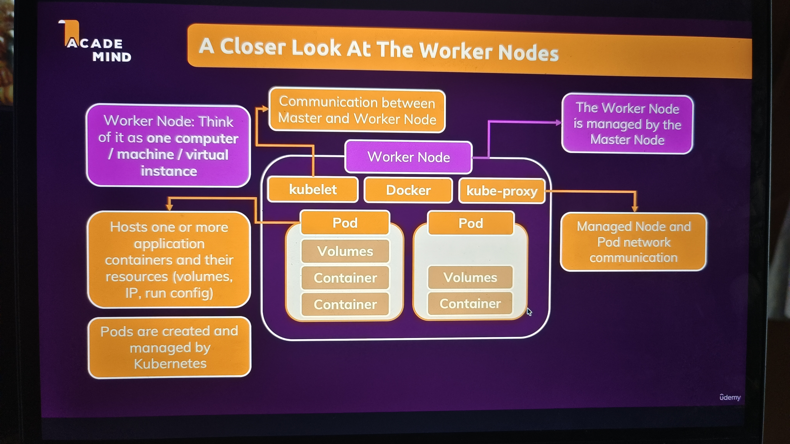
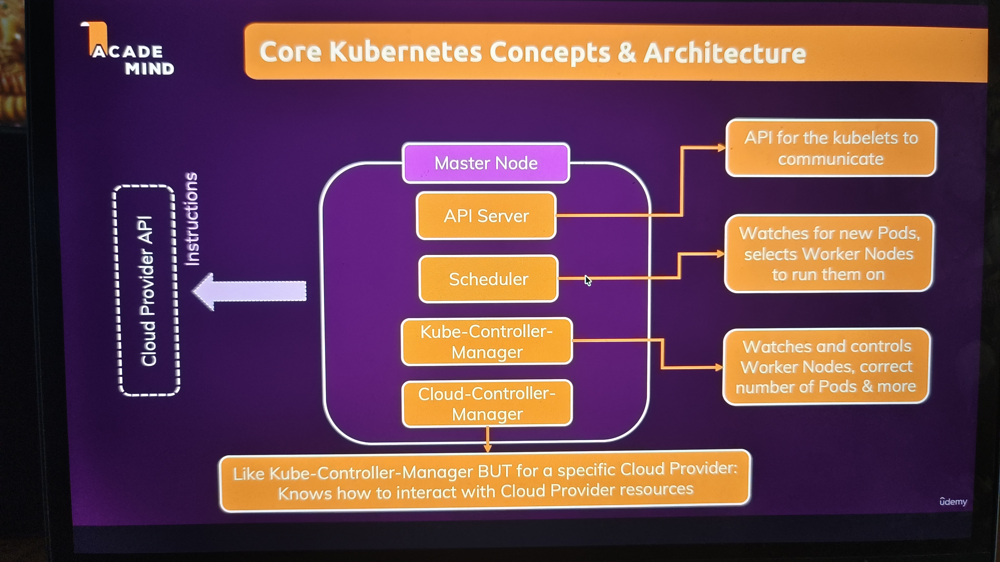
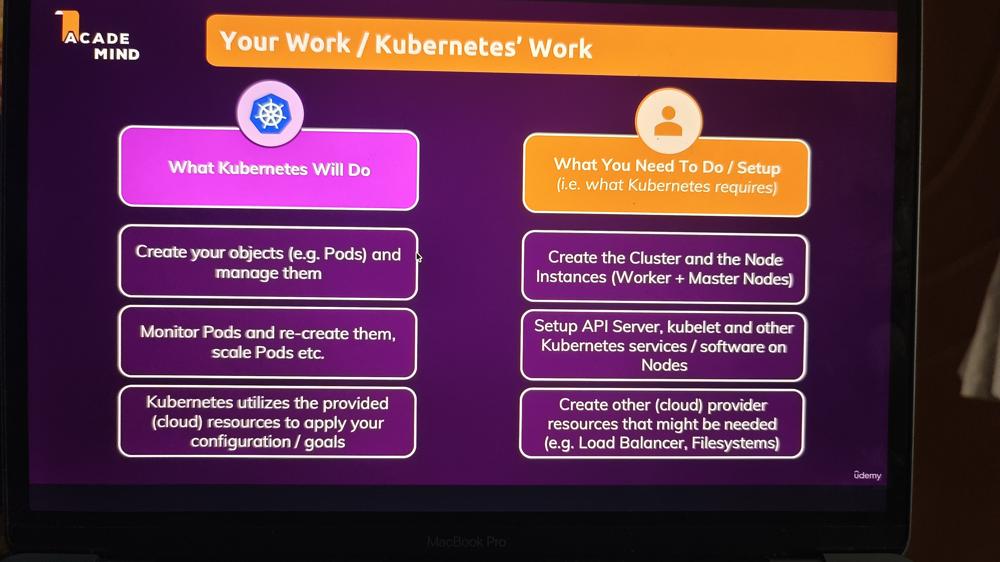

# Kubernetes Notes

## Why kubernetes?

> 1. Manual deployment of containers is hard to maintain, error-prone and annoying.
> 2. Containers might crash / go down and need to be replaced. (Container health checks + automatic re-deployment)
> 3. We might need more container instances upon traffic spikes. (Autoscaling)
> 4. Incoming traffic should be distributes equally. (Load balancer)

We can even make use of any of the services offered by cloud service provides like AWS, Azure or GCP to handle above all scenario's. But in that case, we'll be locked in with that service provider as their configurations will be specific to those providers. We cannot re-use the same configuration created in one service provider to another service provider.

> 1. Using a specific cloud service locks us into that service.
> 2. You need to learn about the specifics, services and config options of another provider if you want to switch.
> 3. Just knowing Docker isn't enough!

**This is where kubernetes comes into picture!**

### What kubernetes IS and IS NOT?

> 1. kubernetes is not a cloud service provider - it's an open-source project.
> 2. It's not a service by a cloud service provider - it can be used with any provider.
> 3. It's not restricted to any specific cloud service provider - it can be used with any provider.
> 4. It's not just a software you run on some machine - it's a collection of concepts and tools.
> 5. It's not an alternative for docker - tt works together with docker containers.
> 6. It's not a paid service - it's a free open source project.

    Kubernetes is like Docker-Compose for multiple machines.

### Closer look at worker node



### Closer look at master node



### Kubernetes does not manage our infrastructure



    Cloud service provides like AWS and Azure offers managed services that helps us with handling right section of the above slide. AWS offers EKS and Azure offers AKS which helps us getting rid of the right side of the slide.

## Core components

> Cluster - A set of node machines which are running the containerized application (worker nodes) or control other nodes (master nodes).
> 
> Nodes - Physical or virtual machine with a certain hardware capacity which hosts one or multiple pods and communicates with the cluster.
> 
> 1. Master Node - Cluster control plane, managing the pods across worker nodes.
>
> 2. Worker Node - Hosts pods, running app containers (+ resources)
>
> Pods - Pods host the actual running application containers + their required resources (e.g. volumes).
>
> Containers - Normal (Docker) containers
>
> Services - A logical set (group) of pods with a unique, pod- and container- independent IP address.

## Understanding kubernetes Objects

> 1. Kubernetes works with objects. (Pods, Deployments, Services, Volumes etc)
> 2. Objects can be created in two ways: Imperatively or Declaratively

## Managing Data & Volumes with Kubernetes

1. Volumes - Pod level storage - data survives during container restart but not on pod restarts - depending on volume type as well.
2. Persistent Volume - Cluster level storage like a storage detached from any pods.
3. Persistent Volume Claim - Pods use this pvc to claim the required storage space from persistent volume.

**GPT response**

```
1️⃣ emptyDir

Created when pod starts

Deleted when pod is deleted

Pod restart = new pod → data gone ❌

Use case:

Temp files

Caches

2️⃣ hostPath

Data lives on worker node

Pod restart on same node → data survives ✅

Pod scheduled on different node → data lost ❌

⚠️ Not portable
⚠️ Node failure = data loss

3️⃣ Persistent Volume (PVC) ✅ (MOST IMPORTANT)

Backed by:

Cloud disk

Network storage

PVC exists independently of pods

Pod can be deleted and recreated

New pod mounts same PVC → data survives

This is the correct solution for persistence.

4️⃣ ConfigMap / Secret

Recreated when pod starts

Not for persistence

Source-of-truth is etcd, not filesystem
```
